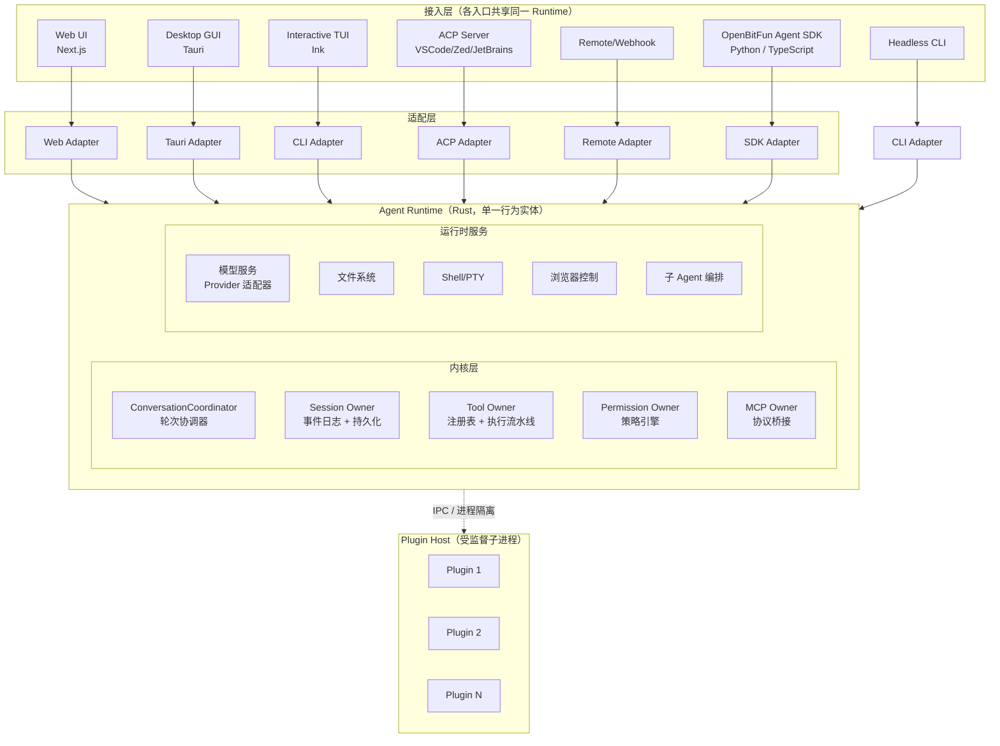
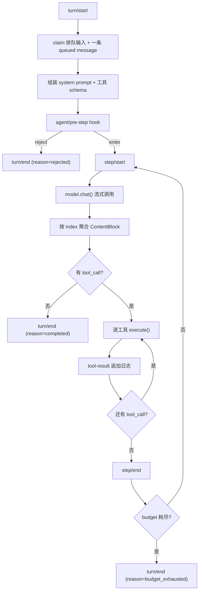
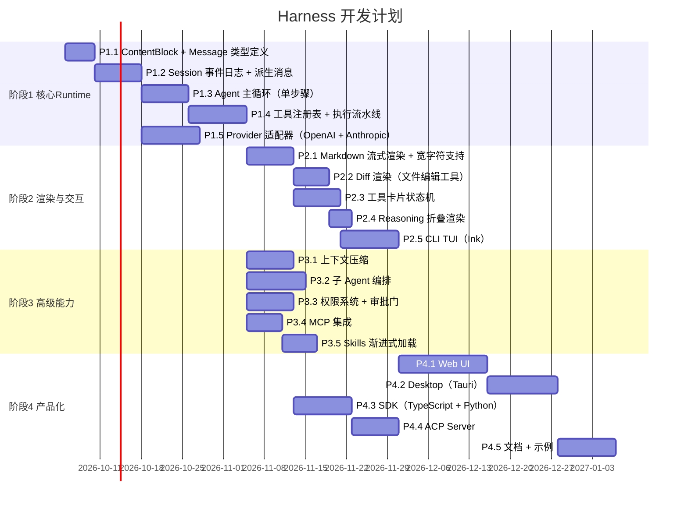

# Agent Harness 项目开发书

> 版本：v0.1-draft
> 日期：2026-10-02
> 范围：参考 DeepSeek Harness / OpenBitFun 设计，定义自研 Agent Harness 的完整开发方案

---

## 一、项目定位与目标

### 1.1 项目定义

**Agent Harness** 是连接 LLM 与执行环境的运行框架。它负责：

- 驱动 Agent 主循环（调用模型 → 解析输出 → 路由工具 → 执行 → 记录结果）
- 管理上下文（提示词组装、历史派生、压缩卸载）
- 提供沙箱执行环境（文件/Shell/MCP/浏览器）
- 支撑多设备访问（Web / TUI / CLI / ACP / Mobile）

### 1.2 核心设计原则（参考 DeepSeek Harness + OpenBitFun）

| 原则 | 含义 | 参考来源 |
|---|---|---|
| **一切皆插件** | 每个子系统（模型适配器、工具注册表、session 日志、agent loop）都是可替换插件 | DSH Cordis 架构 |
| **Session 是唯一真源** | 对话历史从仅追加事件日志派生，不单独存储；渲染产物可重放 | DSH SessionEvent 设计 |
| **分层 Owner 边界** | 每个模块只有一个状态 owner；适配层只做映射，不建立平行业务路径 | OpenBitFun 架构目标 |
| **渐进式 Skill 加载** | 只在任务需要时加载 Skill，保持上下文精简 | DeerFlow 设计 |
| **受监督执行** | 第三方代码运行在隔离子进程，有期限/取消/流控/故障回收 | OpenBitFun 安全设计 |
| **统一 ContentBlock 类型** | 模型输出是类型化块数组，不是字符串；reasoning/text/image/tool-call 分开 | DSH ContentBlockMap |

### 1.3 目标产物

1. **Agent Runtime（Rust）** — 核心运行时，提供会话/工具/权限/执行能力
2. **开放 SDK（Python + TypeScript）** — 面向应用开发者的公开 API
3. **Web UI + Desktop（Tauri）** — 用户交互入口
4. **CLI + ACP Server** — headless 和编辑器集成入口
5. **Plugin Host** — 受监督的扩展运行时

---

## 二、架构总览



---

## 三、核心数据结构设计

### 3.1 ContentBlock（模型输出统一类型）

所有 provider（OpenAI / Anthropic / Grok / DeepSeek）的输出最终映射到这个类型：

```rust
/// 内容块联合类型，对应 DeepSeek Harness ContentBlockMap
#[derive(Debug, Clone, Serialize)]
pub enum ContentBlock {
    /// 普通对话文本
    Text(TextBlock),
    /// 思考过程（reasoning chain）
    Reasoning(ReasoningBlock),
    /// 图片
    Image(ImageBlock),
    /// 文件附件
    File(FileBlock),
    /// 工具调用
    ToolCall(ToolCallBlock),
    /// 动态添加工具定义（开发者消息）
    ToolAddition(ToolAdditionBlock),
    /// 动态移除工具定义（开发者消息）
    ToolRemoval(ToolRemovalBlock),
}

#[derive(Debug, Clone)]
pub struct TextBlock {
    pub text: String,           // 流式累积，最终不可变
}

#[derive(Debug, Clone)]
pub struct ReasoningBlock {
    pub text: String,
    pub budget_tokens: Option<u32>,  // 思考预算标记
}

#[derive(Debug, Clone)]
pub struct ImageBlock {
    pub data: Vec<u8>,
    pub mime: String,
}

#[derive(Debug, Clone)]
pub struct ToolCallBlock {
    pub id: ToolCallId,
    pub name: String,
    pub arguments_json: String,     // 原始 JSON 字符串（流式累积）
    pub arguments_parsed: Option<Value>,  // 解析后（完成后）
}
```

### 3.2 Message（消息类型）

```rust
/// 不可变消息，带来源标记
#[derive(Debug, Clone)]
pub struct Message {
    pub role: MessageRole,         // user / assistant / tool / system / developer
    pub content: Vec<ContentBlock>,
    pub source: MessageSource,     // 来自哪里：用户 / 模型 / 工具 / 系统提示 / 注入
    pub metadata: MessageMetadata,
}

#[derive(Debug, Clone)]
pub enum MessageSource {
    User { kind: String },                    // 直接输入
    Model { provider: String, model: String, replay_state: Option<Value> },
    Tool { tool_name: String, is_error: bool },
    SystemPrompt { route: String, node_index: usize },
    Developer { kind: String },               // 注入型（skill content, cron, file-change 通知）
}
```

### 3.3 SessionEvent（仅追加日志，唯一真源）

```rust
/// 事件溯源：所有事实追加到日志，对话历史由此派生
#[derive(Debug, Clone, Serialize, Deserialize)]
pub enum SessionEvent {
    // 轮次生命周期
    TurnStart { turn: TurnId },
    TurnEnd { turn: TurnId, reason: TurnEndReason },

    // 步骤生命周期（一次模型调用 + 其所有工具执行）
    StepStart { turn: TurnId, step: StepId },
    StepEnd { turn: TurnId, step: StepId },

    // 消息
    UserMessage(UserMessage),
    AssistantMessage(AssistantMessage),
    ToolResultMessage(ToolResultMessage),
    SystemMessage(SystemMessage),
    DeveloperMessage(DeveloperMessage),

    // 工具变更（step 内动态增减工具）
    ToolAddition { seq: SessionSeq, message_id: MessageId },
    ToolRemoval { seq: SessionSeq, tool_name: String },

    // 上下文压缩
    CompactionStart { turn: TurnId, step: StepId },
    CompactionSummary { summary: String },
    CompactionEnd { turn: TurnId, step: StepId },

    // 子 Agent
    SubAgentSpawn { sub_agent_id: AgentId, parent_turn: TurnId },
    SubAgentResult { sub_agent_id: AgentId, result: SubAgentResult },
}
```

**关键设计：消息历史从日志派生，不单独存储。**
这意味着：
- 任何渲染状态都可以从事件日志重新计算
- 持久化 = 持久化事件日志，而不是持久化 parsed 消息
- 崩溃恢复 = 重放事件日志到检查点

---

## 四、Agent 主循环设计

### 4.1 轮次与步骤的定义

| 概念 | 定义 | 对应事件 |
|---|---|---|
| **轮次（Turn）** | 一次用户输入到完成的所有步骤 | `turn/start` → ... → `turn/end` |
| **步骤（Step）** | 一次模型调用 + 它触发的所有工具执行 | `step/start` → `assistant/message` → tool-results → `step/end` |

一个轮次可以包含零个步骤（用户输入被拒绝或为空）、一个步骤或多个步骤（迭代）。

### 4.2 主循环状态机



### 4.3 Agent 句柄与所有权

```
创建 Agent：
  ctx.agents.create(session_id) → AgentHandle { agent, dispose() }
  dispose() 会：停止循环 → 等待退出 → 注销 Agent → 删除 Session → 撤销作用域注册

恢复 Agent：
  ctx.agents.resume(persistent_session_id) → AgentHandle
  从事件日志加载状态，继续执行

所有权模型：
  - 只有持有 AgentHandle 的调用方可以 dispose()
  - AgentLoop 拥有的 config-created agents 没有外部句柄
  - 取消 signal 可以中断正在进行的 step
```

---

## 五、工具系统架构

### 5.1 ToolDefinition 结构

每个工具声明自己的完整生命周期契约：

```rust
pub struct ToolDefinition {
    // ── 面向模型的字段（会进入 system prompt）──
    pub name: String,
    pub description: String,
    pub parameters: JsonSchemaNode,   // JSON Schema

    // ── 面向执行的字段（不暴露给模型）──
    pub execute: Arc<dyn ToolExecutor>,
    pub timeout_ms: Option<u64>,
    pub is_concurrency_safe: bool,

    // ── 输出渲染契约 ──
    pub output: ToolOutputDefinition,   // schema + render()

    // ── 生命周期钩子 ──
    pub project_content: Option<ProjectContentFn>,   // 执行后替换展示内容
    pub finalize_content: Option<FinalizeContentFn>, // 最终变换（同步、不可失败）
}

pub struct ToolOutputDefinition {
    pub schema: JsonSchemaNode,
    pub render: fn(args: &Value, value: &Value) -> Vec<ContentBlock>,
    pub presentation_meta: Option<fn(args: &Value, value: &Value) -> Value>,
}
```

### 5.2 工具执行流水线

```
用户输入
    ↓
Agent Loop 认领输入
    ↓
组装 prompt（system + history + tool_schemas）
    ↓
模型调用 → tool_call 列表
    ↓
[审批门：human-in-the-loop]
    ↓
foreach tool_call:
    ↓ 执行前：projectContent?() 可替换展示内容
    ↓ execute(args, signal) → canonical_value
    ↓ 执行后：finalizeContent?() 最终变换
    ↓ 写入 session 日志（ToolResultMessage）
    ↓ 派生 assistant message（含 tool_result）
    ↓ 检查 budget / 中断信号
    ↓ 继续或结束
```

### 5.3 Diff 渲染的设计位置

Diff **不是** LLM 输出的一个类型。它是**文件编辑工具的执行结果**经过 `render()` 投影后的展示形态：

```
FileEditTool.execute() → 返回 { old: str, new: str, path: str }
    ↓
ToolOutputDefinition.render(args, value)
    ↓ 调用 diff-match-patch 计算差异
    ↓ 返回 Vec<ContentBlock> { type: "file_diff", path, hunk_list }
    ↓
UI 层收到 file_diff block → 渲染为行级 color diff
```

这意味着：
- 不同工具可以有不同类型的输出渲染（表格 / diff / 文本 / 图片）
- 渲染逻辑随工具定义，不集中在 harness 里
- `projectContent` 钩子允许在执行后、进入日志前**替换**渲染内容（例如把原始 diff 文本换成带行号的 HTML）

---

## 六、流式渲染管线

### 6.1 从 SSE 到 ContentBlock 的转换

```
LLM API SSE 事件流
    │
    ├─ message_start
    │     ↓
    │   初始化 BlockPool（按 index 预留块）
    │
    ├─ content_block_start(index, type)
    │     ↓
    │   创建对应类型的块，标记流式状态
    │
    ├─ content_block_delta(index, delta)
    │     ↓
    │   根据 type 追加到对应块：
    │   - text_delta → TextBlock.text += delta
    │   - reasoning_delta → ReasoningBlock.text += delta
    │   - input_json_delta → ToolCallBlock.arguments_json += delta
    │
    ├─ content_block_stop(index)
    │     ↓
    │   标记块完成，触发状态切换：
    │   - ToolCallBlock：arguments_json 完整 → parse JSON → 切到 INPUT_AVAILABLE
    │   - TextBlock：完整文本 → 触发 Markdown 增量解析
    │
    └─ message_stop
          ↓
        组装完整 AssistantMessage → 写入 session 日志
```

### 6.2 Markdown 增量渲染策略

```
问题：Markdown 是上下文相关的，未闭合的代码围栏会吞噬后续内容

解决方案：
┌──────────────────────────────────────────────────────┐
│  收到 chunk → 追加到 raw_buffer                       │
│  节流 100ms → 对整个 buffer 重解析                     │
│  遇到未闭合围栏 → 立即渲染为 <pre><code>（不等待闭合）  │
│  围栏闭合 → 应用完整语法高亮（Shiki）                  │
│  完整消息到达 → 最终渲染（稳定版本）                    │
└──────────────────────────────────────────────────────┘
```

### 6.3 工具卡片状态机（UI 层）

```
状态流转：
INPUT_STREAMING  →  ⏳ 骨架屏（显示工具名 + 正在收集参数）
       ↓
INPUT_AVAILABLE  →  🔧 展示参数表单 + "确认执行"按钮（human-in-the-loop 挂点）
       ↓（用户批准）
EXECUTING        →  ⚙️ spinner + 执行时间显示
       ↓
OUTPUT_READY     →  ✅ 调用 tool.output.render() 展示结果
       ↓
OUTPUT_ERROR     →  ❌ 红色错误信息 + 重试选项

特殊处理：
- 长时执行（>5s）→ 显示ETA或进度条
- 中断/取消 → 显示"已取消"状态，不报错
- 超时 → OUTPUT_ERROR，错误码区分"超时"vs"执行失败"
```

### 6.4 Reasoning 渲染策略

```
模型输出 ReasoningBlock
    ↓
默认折叠显示（灰色斜体，显示 token 预算占多少）
    ↓
用户点击展开 → 渲染完整 thinking 内容
    ↓
 thinking 内容不注入 system prompt（除非显式要求）
    ↓
 reasoning 消耗的 token 计入模型使用统计，但不计入上下文窗口
```

---

## 七、上下文管理设计

### 7.1 System Prompt 组装

```
System Prompt = 固定片段 + 动态片段 + 工具 Schema

固定片段（来自 system-prompt 插件）：
  - 角色定义
  - 行为规范
  - 安全约束

动态片段（每次 step 前计算）：
  - 当前任务上下文（当前目录、AGENTS.md、skill 内容）
  - 文件变更通知（如果上次 step 后有文件修改）
  - Skill 加载内容（渐进式，仅加载需要的 skill）

工具 Schema（来自 tool registry，白名单过滤）：
  - 只暴露当前 agent 有权使用的工具
  - 每个工具的 description 最长 1024 字符（OpenAI 限制）
```

### 7.2 上下文压缩（Compaction）

```
触发条件：
  - 上下文接近模型窗口上限（如 >80%）
  - 用户手动触发
  - 长时间运行的 agent 自动触发

压缩策略：
  1. 保留最近的 N 条消息
  2. 对早期消息生成摘要（调用另一个模型）
  3. 用摘要替换原始消息，写入 compaction/summary 事件
  4. 压缩后的历史继续参与后续 step

关键设计：
  - 压缩是**可逆的日志操作**，不是删除
  - 压缩摘要作为一个新的 system message 节点插入
  - 原始事件保留在日志中（用于重放），但不再派生到 prompt
```

### 7.3 工具输出卸载

长工具输出（如文件内容、搜索结果）不直接放入上下文：

```
工具执行返回大文本 → 写入临时文件 → 只把文件路径注入 tool_result
模型后续可以 read_file 读取 → 避免上下文膨胀
```

---

## 八、多 Agent 编排设计

### 8.1 Agent 层级

```
Lead Agent（主 Agent）
  ├── 直接响应用户输入
  ├── 决定何时委派子 Agent
  └── 整合子 Agent 结果

Sub Agent（子 Agent）
  ├── 拥有独立的 Session（隔离上下文）
  ├── 有独立的工具集（可 restricted）
  ├── 有独立的 permissions 策略
  └── 完成后把结果返回给 Lead Agent
```

### 8.2 委派模式

| 模式 | 用法 | 场景 |
|---|---|---|
| **Fork** | `AgentSpawn` → `AgentWait` | 并行研究多个方向 |
| **Pipeline** | A 完成后自动触发 B | 多步骤工作流 |
| **Delegation** | Lead Agent 内联委托 | 将特定子任务交给专家 Agent |
| **Handoff** | Agent 之间转移对话权 | 角色切换（研究者 → 写作者） |

### 8.3 上下文隔离

```
Sub Agent 创建时：
  - 复制 Lead Agent 的当前会话快照（fork cut）
  - 可选：注入 seed 前缀（让子 Agent 有上下文锚点）
  - 可选：继承部分工具（allowlist 过滤）
  - 独立的 system prompt（可叠加角色定义）

子 Agent 完成后：
  - 结果写入子 Agent 的 session 日志
  - 摘要或完整结果通过 AgentResult 事件返回给 Lead Agent
  - Lead Agent 的上下文不受子 Agent 内部操作影响
```

---

## 九、安全与权限设计

### 9.1 三层权限模型

```
┌─────────────────────────────────────────┐
│ L1：工具级权限（ToolDefinition.allowed-tools）│
│   - 每个 Skill 声明自己可以用哪些工具        │
│   - 未声明的工具模型不可见                   │
│   - slash-activate 后才生效                 │
├─────────────────────────────────────────┤
│ L2：执行级权限（Permission Policy）         │
│   - 文件写入：是否允许 overwrite             │
│   - Shell 命令：是否允许危险命令（rm, sudo） │
│   - 网络请求：是否允许出站 HTTP              │
│   - 审批门：某些工具执行前必须用户确认        │
├─────────────────────────────────────────┤
│ L3：进程级隔离（Plugin Host）               │
│   - 第三方 Plugin 运行在子进程               │
│   - 有 CPU/内存/时间限制                     │
│   - 故障回收（crash → 重启或终止）           │
│   - 没有 OS 硬边界时，不宣称完全隔离          │
└─────────────────────────────────────────┘
```

### 9.2 审批门（Human-in-the-loop Gate）

```
工具执行前检查点：
  - 高风险工具（rm, sudo, 网络请求）→ 强制审批
  - 中风险工具（文件写入）→ 默认审批，可配置静默
  - 低风险工具（read_file, grep）→ 无需审批

审批 UI 状态：
  INPUT_AVAILABLE 阶段暂停
  → 展示工具名 + 参数预览
  → 用户可：批准 / 编辑参数 / 拒绝
  → 拒绝后 tool_result 标记为 "rejected"，继续循环
```

---

## 十、技术选型

| 层面 | 选型 | 理由 |
|---|---|---|
| **Runtime 语言** | Rust | 性能、内存安全、跨平台；参考 OpenBitFun + jcode 验证 |
| **UI 语言** | TypeScript + React | 生态成熟，Tauri 支持好；参考 DeepSeek Harness |
| **前端框架** | Next.js + Ink（TUI） | Web 用 Next.js，CLI 用 Ink（React for CLI） |
| **桌面客户端** | Tauri 2.x | 比 Electron 更轻量；Rust + Web 混合 |
| **图运行时** | 自研协程 + async/await | 不依赖 LangGraph；保持最小依赖 |
| **事件存储** | SQLite（本地）+ Postgres（服务端） | SQLite 开箱即用，Postgres 用于多实例部署 |
| **追踪系统** | OpenTelemetry | 厂商中立，兼容 LangSmith / Langfuse |
| **插件系统** | WASM 子进程 | 比原生进程更安全，比纯 JS 性能更好 |
| **MCP 支持** | 官方 MCP SDK | 标准协议，多工具生态 |

---

## 十一、模块拆分与开发里程碑

## 十一、模块拆分与开发里程碑

### 11.1 仓库结构（参照 DSH + OpenBitFun 实际布局）

```
harness/
│
├── apps/                          # 产品入口（各形态的启动器）
│   ├── web/                       # Web UI（Next.js）← 对应 DSH dsh-web-app
│   ├── desktop/                   # Tauri Desktop ← 对应 OpenBitFun products/desktop
│   ├── cli/                       # CLI + Ink TUI ← 对应 DSH dsh-headless
│   ├── sdk-server/                # SDK JSON-RPC Server ← 对应 DSH dsh-sdk-app
│   └── acp-server/                # ACP 协议服务器 ← 对应 DSH dsh-acp-app
│
├── crates/                        # Rust 核心库（对应 OpenBitFun openbitfun-core）
│   ├── harness-runtime/            # Agent 主循环 + 轮次协调（ConversationCoordinator）
│   ├── harness-session/            # 事件日志 + 持久化（Session Event Store）
│   ├── harness-tools/              # 工具注册表 + 执行流水线
│   ├── harness-permission/         # 权限策略引擎
│   ├── harness-context/            # System prompt 组装 + 上下文压缩
│   ├── harness-model/              # Provider 适配器（OpenAI/Anthropic/Grok/DeepSeek）
│   ├── harness-sandbox/            # 沙箱引擎（本地/Docker/E2B）
│   ├── harness-mcp/                # MCP 协议桥接
│   ├── harness-subagent/           # 子 Agent 编排
│   ├── harness-plugin-host/        # Plugin Host（WASM 子进程隔离执行）
│   └── harness-event/              # 事件类型定义 + 序列化（对应 DSH SessionEventMap）
│
├── packages/                      # TypeScript 包（对应 DSH packages/）
│   ├── sdk-typescript/            # 公开 TS SDK（对应 DSH TypeScript SDK）
│   ├── ui-components/             # 共享 UI 组件库（Markdown/Diff/ToolCard）
│   ├── adapter-web/               # Web 适配层（对应 DSH web-app bundle）
│   ├── adapter-desktop/           # Tauri 适配层（对应 DSH desktop bundle）
│   ├── adapter-cli/               # CLI 适配层（对应 DSH headless bundle）
│   └── adapter-acp/               # ACP 适配层（对应 DSH acp-app bundle）
│
├── profiles/                      # 启动配置组合（对应 DSH profile 概念）
│   ├── web.yaml                   # Web 模式组合：base + web-app
│   ├── headless.yaml              # Headless 模式组合：base + headless
│   ├── sdk.yaml                   # SDK 模式组合：base + sdk-app
│   ├── acp.yaml                   # ACP 模式组合：base + acp-app
│   └── desktop.yaml               # Desktop 模式组合：base + desktop
│
├── skills/                        # 内置 Skills（渐进式加载）
│   ├── research/                  # 研究技能
│   ├── report-generation/         # 报告生成
│   ├── code-review/               # 代码审查
│   └── slide-creation/            # PPT 制作
│
├── plugins/                       # 示例插件（WASM 子进程）
│   ├── plugin-example/
│   └── plugin-mcp-bridge/
│
├── docs/                          # 架构文档
│   ├── architecture/
│   │   ├── product-architecture.md
│   │   ├── agent-runtime-services-design.md
│   │   └── agent-runtime-deployment-design.md
│   └── subsystems/
│       ├── core.md
│       ├── session.md
│       ├── tools.md
│       ├── llm-streaming.md
│       └── permission.md
│
├── scripts/                       # 构建/测试脚本
├── Cargo.toml                     # Rust workspace
├── package.json                   # pnpm workspace
├── pnpm-workspace.yaml
└── README.md
```

**与参考项目对比：**

| DSH 结构 | OpenBitFun 结构 | Harness |
|---|---|---|
| `packages/bundle/base/` | `openbitfun-core/` | `crates/harness-runtime` + `crates/harness-*` |
| `packages/bundle/web-app/` | `apps/desktop/` (Tauri) | `packages/adapter-web/` + `apps/web/` |
| `packages/bundle/headless/` | `apps/cli/` | `packages/adapter-cli/` + `apps/cli/` |
| `profiles/web.yaml` | `products/` | `profiles/*.yaml` |
| `.agents/` (agent配置) | `extensions/` (MiniApp) | `skills/` + `plugins/` |
| Cordis 插件树 | Plugin Host (WASM) | harness-plugin-host |


### 11.2 开发里程碑（Gantt）



### 11.3 关键路径分析

```
关键路径：P1.2 → P1.3 → P1.4 → P2.2 → P4.1
         （Session → Agent Loop → Tools → Diff → Web UI）

并行路径：
  P1.5（Provider）可与 P1.2-P1.4 并行
  P2.3（工具卡片）可与 P2.2 并行
  P3.x（高级能力）可在 P1.4 完成后开始
```

---

## 十二、关键决策记录（ADR）

### ADR-001：为什么用 Rust 做 Runtime？

**决策**：核心 Runtime 用 Rust 实现，UI/SDK 用 TypeScript/Python。

**理由**：
- Agent 主循环是 CPU 密集型（高频模型调用 + 工具执行），Rust 零成本抽象适合
- 内存安全：防止工具执行中的 use-after-free / data race
- 跨平台：一处编译，Windows/macOS/Linux
- 与 OpenBitFun / jcode / Grok Build 的行业趋势一致

**替代方案**：纯 TypeScript（参考 DeepSeek Harness）——放弃，因为性能和安全边界不如 Rust。

---

### ADR-002：Session 为什么用事件溯源而不是直接存储消息？

**决策**：Session = 仅追加 `SessionEvent` 日志，消息历史由此派生。

**理由**：
- 单一真源：避免日志和消息不同步
- 重放能力：崩溃恢复只需重放事件
- 可扩展：新的事件类型通过 declaration merging 加入，不影响现有日志
- 压缩友好：压缩操作是新增事件（summary），不删除旧事件

**替代方案**：直接存储 `Message[]`——放弃，因为无法重放、无法追溯变更历史。

---

### ADR-003：为什么 Diff 渲染放在 ToolOutputDefinition 里而不是 harness 全局？

**决策**：每个工具声明自己的 `render()` 函数，harness 不硬编码任何渲染逻辑。

**理由**：
- 不同工具有不同的输出形态（diff / 表格 / 文本 / 图片）
- 渲染逻辑随工具定义，便于测试和替换
- 符合"一切皆插件"原则

**替代方案**：harness 内置 diff renderer——放弃，因为过于耦合，无法支持非文件工具的输出。

---

### ADR-004：为什么 Reasoning 和 Text 分开？

**决策**：`ContentBlock` 中有独立的 `ReasoningBlock`，不与 `TextBlock` 合并。

**理由**：
- 渲染策略不同：reasoning 默认折叠，text 直接展示
- Token 预算独立：reasoning 消耗单独统计
- 安全隔离：reasoning 内容不注入 system prompt（防止 prompt injection via thinking）

**替代方案**：统一用 TextBlock + 元数据标记——放弃，因为类型安全差，消费方需要额外判断。

---

## 十三、风险与缓解

| 风险 | 影响 | 缓解措施 |
|---|---|---|
| Rust 学习曲线陡峭 | 开发速度下降 | 核心模块由有经验工程师负责，外包 UI 层给 TS 团队 |
| 事件日志膨胀 | 性能下降 | 压缩策略 + 分段存储（热/冷数据分离） |
| Provider API 变更 | 适配层维护成本 | Provider 适配器严格隔离，变更只影响单个适配器 |
| WASM 插件安全边界 | 沙箱逃逸风险 | 多层隔离：进程级 + WASM sandbox + 权限策略 |
| 流式渲染一致性 | UI 状态错乱 | 所有渲染从 SessionEvent 派生，不依赖本地状态 |

---

## 十四、参考资源

- DeepSeek Harness 架构文档：`https://github.com/deepseek-ai/deepseek-harness/tree/master/docs`
- OpenBitFun 产品架构：`https://github.com/GCWing/OpenBitFun/tree/main/docs/architecture`
- Anthropic Agent Harness 工程博客：`anthropic.com/engineering/`
- Cordis 框架（DSH 底层）：`github.com/cordiverse/cordis`
- AG-UI 协议：`docs.ag-ui.com`
- MCP 协议：`modelcontextprotocol.io`

---

*文档版本：v0.1-draft | 基于 DeepSeek Harness + OpenBitFun 架构分析 | 2026-10-02*
